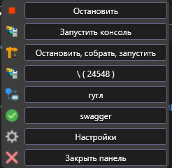
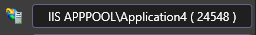
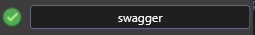
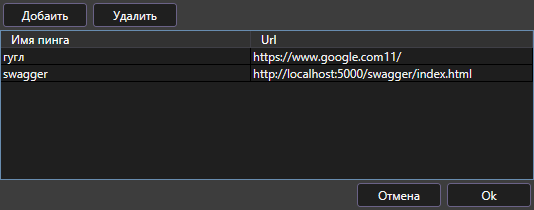

# IISTools
##### Плагин сминимальным набором инструментов для IIS
Главная панель с инструментами выглядит так: 

##### Возможности:
* Остановить сервис если он запущен или запустить, если остановлен
* Запустить консоль IIS 
* Пересобрать решение, а если IIS запущен то произайдет остановка, пересборка и запуск IIS 
* Подключиться к проыессу. Если студия запущена от имени администратора, то увидите владеьца процесса 
* 
* Блок элементов для пинка узлов
	- Для подключения к процессу, спарва надо оживить сайт, для этого его надо пингануть
	-  - пинг не запускали
	-  - пинг выполнен успешно
	-  - пинг неудачен
* Окно настроек. В этом окне можно настроить список сайтов для пинга. Все эти сайты будут отображаться в панели 

	